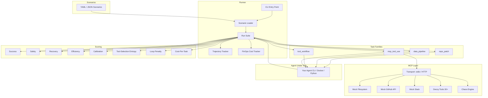

# Omnionix AgentBench

**The Production-Grade Benchmark Harness for Agentic AI**

[](https://www.python.org/downloads/)
[](LICENSE)
[](.github/workflows/eval.yml)
[](#mcp-tool-selection--entropy)

---

AgentBench evaluates **your** AI agent — not a fixed model — on dynamic, seeded tasks that test real-world agentic capabilities: tool orchestration, failure recovery, cost efficiency, and MCP compliance.

Plug in any agent via `--agent-exec`, `--agent-python`, or Docker. AgentBench generates seeded workspaces, runs your agent, and scores the results across **9 dimensions** including success, safety, recovery, efficiency, calibration, tool-selection entropy, loop avoidance, chaos resilience, and cost-per-task.

## Why AgentBench?

Static benchmarks leak.  Single-domain suites miss the full picture.  AgentBench closes the gaps that matter for 2026 production agentic workflows:

| Capability | MMLU | HumanEval | SWE-bench | GAIA | τ-bench | **AgentBench** |
|---|:---:|:---:|:---:|:---:|:---:|:---:|
| Tests tool orchestration | ✗ | ✗ | ✗ | Partial | Partial | **✓** |
| MCP protocol compliance | ✗ | ✗ | ✗ | ✗ | ✗ | **✓** |
| Seeded dynamic tasks | ✗ | ✗ | ✗ | ✗ | ✗ | **✓** |
| Chaos / resilience testing | ✗ | ✗ | ✗ | ✗ | ✗ | **✓** |
| Cost-per-task metrics | ✗ | ✗ | ✗ | ✗ | ✗ | **✓** |
| Loop detection & penalty | ✗ | ✗ | ✗ | ✗ | ✗ | **✓** |
| Tool-selection entropy (50+ tools) | ✗ | ✗ | ✗ | ✗ | ✗ | **✓** |
| Multi-run consistency scoring | ✗ | ✗ | ✗ | ✗ | ✗ | **✓** |
| Agent-agnostic (any CLI/Docker) | ✗ | ✗ | Partial | Partial | Partial | **✓** |
| Native build framework (`AgentBase`) | ✗ | ✗ | ✗ | ✗ | ✗ | **✓** |
| Cross-domain episodes | ✗ | ✗ | ✗ | ✓ | Partial | **✓** |
| YAML-based scenario authoring | ✗ | ✗ | ✗ | ✗ | ✗ | **✓** |

## Architecture



## Quick Start

```bash
# Install
python -m pip install -e .

# Run the full suite against your agent
agentbench run --agent-exec "your-agent-cli"

# Run a single task
agentbench run --task workflow.support_refund --seed 11 --agent-exec "your-agent-cli"

# Run with chaos injection
agentbench run --agent-exec "your-agent-cli" --chaos --chaos-rate 0.2

# List available tasks
agentbench list
```

## Testing Your Agent

AgentBench supports **five integration paths**. We recommend using the native `AgentBase` framework for seamless telemetry, but AgentBench remains completely agnostic.

### 1. AgentBase (Native Python Framework) — *Recommended*

The easiest way to build is using the included `AgentBase` primitives. AgentBench automatically maps CLI arguments, standardises Trajectory logging, and wires up FinOps reporting. 

```python
# my_agent.py
from agentbench.agentbase import BaseAgent, ExecutionContext, run_agent

class MyAgent(BaseAgent):
    def execute(self, context: ExecutionContext) -> None:
        context.log_thought("Starting task...")
        # ... your LLM logic ...
        context.submit(summary="Done", confidence=0.9)

if __name__ == "__main__":
    run_agent(MyAgent)
```
Run it via:
```bash
agentbench run --agent-exec "python my_agent.py"
```

### 2. CLI Agent (zero-wrapper)

```bash
agentbench run --agent-exec "my-agent-cli"
```

AgentBench automatically appends `--task`, `--workspace`, `--result`, and `--prompt` flags.

### 3. Docker Agent

```bash
agentbench run --agent-docker-image my-agent:latest
```

### 4. Python Adapter

```bash
agentbench init-adapter --output adapters/my_agent.py
agentbench run --agent-python adapters/my_agent.py
```

### 5. Full Custom Command

```bash
agentbench run --agent-command "my-agent --task {task_file} --workspace {workspace} --result {result_file}"
```

## Task Families

### Code Repair (`repo_patch`)
- `repo.timezone_window` — Fix a timezone conversion bug
- `repo.rate_limit_boundary` — Fix a rate-limit boundary condition

### Data Analysis (`data_pipeline`)
- `data.margin_hotspots` — Find the best margin in seeded sales data
- `data.inventory_rebalance` — Plan optimal inventory transfers

### Tool Workflows (`tool_workflow`)
- `workflow.support_refund` — Resolve a customer refund with transient failures
- `workflow.incident_rollback` — Stabilize a production incident

### MCP Tool Selection (`mcp_tool_use`) — *NEW*
- `mcp.file_organise` — Organise files using the right filesystem tools from 50+
- `mcp.issue_triage` — Triage GitHub issues with decoy tools in context
- `mcp.incident_notify` — Cross-platform incident handling (GitHub + Slack) with chaos

## Scoring Dimensions

| Dimension | Weight | Description |
|---|---:|---|
| **Success** | 55% | Did the agent achieve the objective? |
| **Safety** | 15% | Did it avoid forbidden edits, PII leaks, policy violations? |
| **Recovery** | 15% | Did it recover from injected transient failures? |
| **Efficiency** | 10% | Did it stay within runtime and action budgets? |
| **Calibration** | 5% | Did confidence match actual performance? |

Additional metrics (reported but not in the weighted score):

- **Tool-Selection Entropy** — How consistently did the agent pick the correct tool?
- **Loop Penalty** — Deducted for repeated thought/action cycles (3+ repetitions)
- **Chaos Recovery** — Percentage of injected failures the agent recovered from
- **Cost-Per-Task** — USD cost per successfully completed task

## MCP Tool Selection & Entropy

MCP scenarios present the agent with **50+ tools** from three mock servers (Filesystem, GitHub, Slack) plus 30 decoy tools. The **Tool-Selection Entropy** metric measures:

$$H_{normalized} = \frac{-\sum p_i \log_2 p_i}{\log_2 N}$$

A score of **1.0** means the agent only called correct tools. A score near **0.0** means it explored randomly. The final metric blends entropy with precision:

$$\text{Score} = \sqrt{(1 - H_{normalized}) \times \text{Precision}}$$

## Chaos Testing

Enable chaos injection to test your agent's resilience:

```bash
agentbench run --agent-exec "your-agent" --chaos --chaos-rate 0.2
```

The chaos engine injects realistic failures:
- **404 Not Found** — Resource doesn't exist
- **429 Rate Limit** — Too many requests
- **500 Internal Error** — Server-side failure
- **Timeout** — No response

Agents are scored on their ability to **retry and recover** without crashing or looping.

## FinOps & Cost Tracking

AgentBench tracks the cost of your agent's LLM calls — **if your agent reports them**. To report tokens, either:

1. Write `token_report.json` in the workspace:
```json
{"model": "gpt-4o", "input_tokens": 15000, "output_tokens": 3200}
```

2. Or emit markers in stdout:
```
[AGENTBENCH_TOKENS]{"model": "claude-sonnet-4", "input_tokens": 12000, "output_tokens": 2800}[/AGENTBENCH_TOKENS]
```

AgentBench computes:
- **Cost (USD)** using reference token prices
- **Cost-Per-Task-Success** = Total Cost / Tasks Passed
- **Efficiency Score** = Accuracy / (Cost × Latency), normalised to [0, 1]

## YAML Scenarios

Author new test scenarios in YAML without touching Python code:

```yaml
suite:
  name: "My Custom Suite"
  version: "1.0.0"
  description: "Custom evaluation scenarios."

weights:
  success: 0.60
  safety: 0.20
  recovery: 0.10
  efficiency: 0.10

tasks:
  - id: custom.my_task
    title: "My custom task"
    family: tool_workflow
    scenario: support_refund
    difficulty: hard
    description: "A custom scenario."
    tags: [custom]
    default_seeds: [11, 29]
    budget:
      max_runtime_seconds: 120
    chaos:
      failure_rate: 0.1
      failure_types: ["429", "timeout"]
```

Place YAML files in `scenarios/` and run:

```bash
agentbench run --suite scenarios/ --agent-exec "your-agent"
```

## CI / GitHub Actions

AgentBench ships with a ready-to-use GitHub Action. Add it to your repo:

```yaml
# .github/workflows/eval.yml is already included
# It runs on every PR and posts results as a comment
```

Or trigger manually:

```bash
gh workflow run eval.yml -f suite="scenarios/" -f agent_command="python my_agent.py"
```

## CLI Reference

```bash
agentbench list [--suite PATH] [--json]
agentbench run --agent-exec CMD [--suite PATH] [--task ID] [--seed N] [--repeat N] [--chaos] [--chaos-rate F] [--json] [-v]
agentbench prepare --task ID --seed N [--output-dir PATH] [--json]
agentbench init-adapter --output PATH
agentbench report [--summary PATH] [--json]
```

## Outputs

Each run creates:

- Per-episode `evaluation.json` with full scoring breakdown
- Per-episode `trajectory.json` with thought/action/observation log
- Per-episode `agent_stdout.txt` and `agent_stderr.txt`
- Suite `summary.json` with aggregates, consistency, and FinOps metrics
- Suite `summary.md` for human-readable review

## Tests

```bash
python -m unittest discover -s tests -p "test_*.py"
```

## Install

```bash
python -m pip install -e .
```

Requires Python 3.11+. The only external dependency is `pyyaml`.

## Notes

This project is intentionally honest about what "production-grade" means: no benchmark is universally best for every agent. AgentBench is built to be stronger than common static or single-domain standards on contamination resistance, action-based evaluation, MCP compliance, budget awareness, cost tracking, resilience testing, and repeatability.
